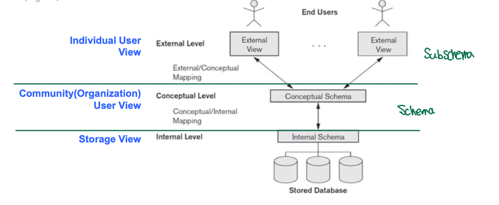
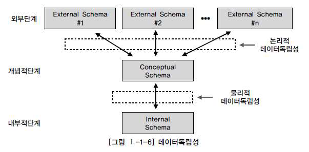

## 01. 모델링(Modeling)

### 1. 모델링의 이해

#### 가. 모델링의 정의

> 현실 세계를 추상화, 단순화, 명확화하기 위해 일정한 표기법에 의해 표현하는 기법

- 인류의 가장 보편적인 특징이면서 욕구 중의 하나는 의사소통을 하면서 항상 그에 대한 기록을 남기는 것
- 어떤 현상에 대해 기록하고 남겨 자신 스스로 또는 다른 사람에게 적절한 의미를 주기 위해 고대부터 기록의 문화는 발전해왔다고 할 수 있음
- 모델(Model) 이라 함은 모형(模型), 축소형(縮小型) 의 의미로서 사람이 살아가면서 나타날 수 있는 다양한 현상에 대해 일정한 표기법에 따라 표현해 놓은 모형이라고 할 수 있음
- 이는 사람이 어떤 목적을 달성하기 위해 의사소통(커뮤니케이션, Communication) 의 효율성을 극대화한 고급화된 표현 방법으로 설명될 수 있음
- 사람이 살아가면서 나타날 수 있는 다양한 현상은 사람, 사물, 개념 등에 의해 발생된다고 할 수 있음
- 모델링(Modeling) 은 이것을 표기법에 의해 규칙을 가지고 표기하는 것 자체를 의미하며, 모델을 만들어가는 일 자체를 모델링으로 정의할 수 있음

> Webster 사전에서 모델링은 다음과 같이 정의
>   - 가설적 또는 일정 양식에 맞춘 표현(a hypothetical or stylized representation)
>   - 어떤 것에 대한 예비 표현으로 그로부터 최종 대상이 구축되도록 하는 계획으로서 기여하는 것
> 다른 정의로는 다음과 같이 정의할 수 있음
>   - 복잡한 '현실 세계' 를 단순화시켜 표현하는 것
> 모델에 대한 정의
>   - 사물 또는 사건에 관한 양상(Aspect) 이나 관점(Perspective) 을 연관된 사람이나 그룹을 위하여 명확하게 하는 것
>   - '현실 세계' 의 추상화된 반영

#### 나. 모델링의 특징

> 앞의 정의를 토대로 모델링을 요약해보면 추상화, 단순화, 명확화라는 특징으로 정리할 수 있음

##### 1) 추상화(모형화, 가설적)

> 현실 세계를 일정한 형식에 맞추어 표현을 한다는 의미
> 즉, 다양한 현상을 일정한 양식인 표기법에 의해 표현하는 것을 의미

##### 2) 단순화

> 복잡한 현실 세계를 약속된 규약에 의해 제한된 표기법이나 언어로 표현하여 쉽게 이해할 수 있도록 하는 개념을 의미

##### 3) 명확화

> 누구나 이해하기 쉽게 하기 위하여 대상에 대한 애매모호함을 제거하고 정확하게 현상을 기술하는 것을 의미

- 정보 시스템 구축 프로세스에서는 모델링을 계획 / 분석 / 설계 단계에서 업무를 분석하고 설계하는 데 이용하고, 이후에 구축 / 운영 단계에서는 변경과 관리의 목적으로 이용하게 됨

#### 다. 모델링의 3가지 관점

- 시스템의 대상이 되는 업무를 분석하여 정보 시스템으로 구성하는 과정에서 업무의 내용과 정보 시스템의 모습을 적절한 표기법(Notation) 으로 표현하는 것을 모델링(Modeling) 이라고 함
- 따라서 모델링은 3가지 관점인 데이터 관점, 프로세스 관점, 데이터와 프로세스의 상관 관점으로 구분하여 설명할 수 있음

##### 1) 데이터(Data) 관점

> 업무가 어떤 데이터와 관련이 있는지 또는 데이터 간 관계는 무엇인지에 대해서 모델링하는 방법(What, Data)

##### 2) 프로세스(Process) 관점

> 업무가 실제로 하고 있는 일이 무엇인지 또는 무엇을 해야 하는지를 모델링하는 방법(How, Process)

##### 3) 데이터와 프로세스의 상관(Interaction) 관점

> 업무가 처리하는 일의 방법에 따라 데이터는 어떻게 영향을 받고 있는지 모델링하는 방법(Interaction)

### 2. 데이터 모델 기본 개념의 이해

#### 가. 데이터 모델링의 정의

- 데이터 모델은 데이터베이스의 골격을 이해하고 그 이해를 바탕으로 SQL 문장을 기능과 성능적인 측면에서 효율적으로 작성하기 위해 꼭 알아야 하는 핵심 요소
- SQL 전문가를 위한 지식에서도 데이터베이스의 논리적인 구조를 이해하는 데이터 모델을 이해하는 것은 그 다음 SQL 문장을 어떻게 구성할 지에 대한 지식과 효율적인 구성에 대한 밑바탕의 지식을 쌓기 위한 핵심 이론이라고 할 수 있음
- 일반적으로 데이터 모델링은 다음과 같이 다양하게 정의될 수 있음

> - 정보 시스템을 구축하기 위해, 해당 업무에 어떤 데이터가 존재하는지 또는 업무가 필요로 하는 정보는 무엇인지를 분석하는 방법
> - 기업 업무에 대한 종합적인 이해를 바탕으로 데이터에 존재하는 업무 규칙(Business Rule) 에 대하여 참(True) 또는 거짓(False) 을 판별할 수 있는 사실을 데이터에 접근하는 방법(How), 사람(Who), 전산화와는 별개의 독립적인 관점에서 명확하게 표현하는 추상화 기법

- 이를 실무적으로 해석해보면 업무에서  필요로 하는 데이터를 시스템 구축 방법론에 의해 분석하고 설계하여 정보 시스템을 구축하는 과정으로 정의할 수 있음
- 데이터 모델링을 하는 이유에는 다음과 같이 정리해볼 수 있음

> 1. 업무 정보를 구성하는 기초가 되는 정보들을 일정한 표기법에 의해 표현함으로써 정보 시스템 구축의 대상이 되는 업무 내용을 정확하게 분석하기 위하여
> 2. 분석된 모델을 가지고 실제 데이터베이스를 생성하여 개발 및 데이터 관리에 사용하기 위하여

- 즉, 데이터 모델링이라는 것은 단지 데이터베이스만을 구축하기 위한 용도로만 쓰이는 것이 아니라, 데이터 모델링을 통해 업무를 설명하고 분석하는 부분에도 매우 중요한 의미를 가지고 있다고 할 수 있음

#### 나. 데이터 모델이 제공하는 기능

- 업무를 분석하는 관점에서 데이터 모델이 제공하는 기능은 다음과 같음

> - 시스템을 현재 또는 원하는 모습으로 가시화하도록 도와줌
> - 시스템의 구조와 행동을 명세화할 수 있게 해줌
> - 시스템을 구축하는 구조화된 틀을 제공
> - 시스템을 구축하는 과정에서 결정한 것을 문서화함
> - 다양한 영역에 집중하기 위해 다른 영역의 세부 사항은 숨기는 다양한 관점을 제공
> - 특정 목표에 따라 구체화된 상세 수준의 표현 방법을 제공

### 3. 데이터 모델링의 중요성 및 유의점

> 데이터 모델링이 중요한 이유로는 아래와 같이 정리해볼 수 있음

#### 가. 파급 효과(Leverage)

- 시스템 구축이 완성되어 가는 시점에서 많은 애플리케이션들이 테스트를 수행하고 대규모의 데이터 이행을 성공적으로 수행하기 위한 많은 단위 테스트들이 수행되고 이러한 과정들이 반복됨
- 각 단위 테스트들이 성공적으로 수행되고 완료되면 이들 전체를 묶어서 병행 테스트, 통합 테스트를 수행하게 됨
- 만약 이러한 시점에 데이터 모델의 변경이 불가피한 상황이 발생하게 되면, 데이터 구조 변경에 따른 표준 영향 분석, 응용 변경 영향 분석 등 많은 영향 분석이 일어나게 되며, 그 이후에도 해당 분야의 실제 변경 작업 역시 발생하게 됨
- 변경을 해야 하는 데이터 모델의 형태에 따라서 그 영향의 정도에 차이가 있겠으나, 이 시기의 데이터 구조의 변경으로 인한 일련의 변경 작업은 전체 시스템 구축 프로젝트에서 큰 위험 요소로 작용함
- 이러한 이유로 시스템 구축 작업 중에서 데이터 설계의 중요성은 매우 높다고 볼 수 있음

#### 나. 복잡한 정보 요구사항의 간결한 표현(Conciseness)

- 데이터 모델은 구축할 시스템의 정보 요구사항과 한계를 가장 명확하고 간결하게 표현할 수 있는 도구
- 정보 요구사항을 파악할 때, 수많은 페이지의 기능적인 요구사항을 파악하는 것보다는 간결하게 그려져 있는 데이터 모델을 리뷰하면서 파악하는 것이 훨씬 빠름
- 데이터 모델은 건축물로 비유하자면 설계 도면에 해당되며, 건축물을 짓는 여러 사람들이 건축물의 설계 도면을 바탕으로 협업하여 아름다운 건축물을 만들어내는 것에 비유할 수 있음
- 데이터 모델은 시스템을 구축하는 많은 관련자들이 설계자의 생각대로 정보 요구사항을 이해하고 이를 운용할 수 있는 애플리케이션을 개발하고 데이터 정합성을 유지할 수 있도록 해주는 도면의 역할
- 이렇게 이상적으로 역할을 할 수 있는 모델이 갖춰야 할 가장 중요한 점은 정보 요구사항이 정확하고 간결하게 표현되어야 한다는 것

#### 다. 데이터 품질(Data Quality)

- 데이터베이스에 담겨 있는 데이터는 기업의 중요한 자산이며, 이러한 데이터는 기간이 오래되면 오래될수록 활용 가치가 높아짐
- 그렇지만 이렇게 오랜 기간동안 저장된 데이터가 정확성이 떨어지고 효용 가치가 없는, 심지어 잘못된 데이터라고 한다면 이는 일부 시스템의 기능이 잘못되어 수정하는 성격의 문제가 아니며, 해당 데이터로 얻을 수 있었던 소중한 비즈니스의 기회를 상실할 수도 있는 문제임
- 이렇듯 중요한 데이터 품질의 문제는 데이터 구조가 설계되고 초기에 데이터가 조금 쌓일 때에는 인지하지 못 하는 경우가 대부분
- 이러한 데이터의 문제는 오랜 기간 숙성된 데이터를 전략적으로 활용하려고 하는 시점에 문제가 드러나기 때문
- 데이터 품질의 문제가 야기되는 중대한 이유 중 하나는 바로 데이터 구조의 문제
- 미정의된 중복 데이터, 데이터 구조에 대한 불충분한 비즈니스 정의, 통합되어야할 분리된 동일 성격의 데이터들에서 발생하는 데이터 불일치 등 데이터 구조의 문제로 인한 데이터 품질의 문제는 완전히 치유하기는 불가능한 경우가 대부분
- 데이터 모델링을 할 때 유의점을 정리해보면 다음과 같음

> 1) 중복(Duplication)
>    데이터 모델은 같은 데이터를 사용하는 사람, 시간, 그리고 장소를 파악하는 데 도움을 주며, 이러한 지식 응용은 데이터베이스가 여러 장소에 같은 정보를 저장하는 실수를 방지할 수 있음
>  
> 2) 비유연성(Inflexibility)
>    데이터 모델을 어떻게 설계했는지에 따라 사소한 업무 변화에도 데이터 모델이 수시로 변경됨으로써 유지보수의 어려움을 가중시킬 수 있음
>    데이터의 정의를 데이터의 사용 프로세스와 분리함으로써 데이터 모델링은 데이터, 프로세스에서 생기는 작은 변화가 애플리케이션과 데이터베이스에 중대한 변화를 야기하지 않도록 방지해줌
>  
> 3) 비일관성(Inconsistency)
>    데이터의 중복이 없더라도 비일관성은 발생할 수 있음
>    신용 상태에 대한 갱신 없이 고객의 납부 이력 정보를 갱신하는 경우를 예로 들 수 있음
>    그 이유는 개발자가 다른 데이터와 모순된다는 고려 없이 일련의 데이터를 수정할 수 있기 때문
>    데이터 모델링을 할 때 데이터와 데이터 간 상호 연관 관계에 대한 명확한 정의는 이러한 위험을 사전에 예방할 수 있도록 해줌

### 4. 데이터 모델링의 3단계 진행

- 데이터 모델은 데이터베이스를 만들어내는 설계서
- 현실 세계에서 데이터베이스까지 만들어지는 과정은 아래와 같이 시간에 따라 진행되는 과정으로서 추상화 수준에 따라 개념적 데이터 모델, 논리적 데이터 모델, 물리적 데이터 모델로 정리해볼 수 있음

- 처음 현실 세계에서 추상화 수준이 높은 상위 수준을 형상화하기 위하여 개념적 데이터 모델링을 전개
- 개념적 데이터 모델은 추상화 수준이 높고 업무 중심적이고 포괄적인 수준의 모델링을 진행
- 참고로 전사적 아키텍처(EA, Enterprise Architecture) 기반의 전사적인 데이터 모델링을 전개할 때는 더 상위 수준인 개괄적인 데이터 모델링을 먼저 수행하고 이후에 업무 영역에 따른 개념적 데이터 모델링을 전개
- 상위 수준인 엔터티(Entity) 중심의 데이터 모델이 완성되면 업무의 구체적인 모습과 흐름에 따른 구체화된 업무 중심의 데이터 모델을 만들어내는데 이것을 논리적인 데이터 모델링이라고 함
- 논리적인 데이터 모델링 이후 데이터베이스의 저장 구조에 따른 테이블 스페이스(Table Space) 등을 고려한 방식을 물리적인 데이터 모델링이라고 함

#### 가. 개념적 데이터 모델링(Conceptual Data Modeling)

- 개념적 데이터베이스 설계(개념 데이터 모델링) 는 조직, 사용자의 데이터 요구사항을 찾고 분석하는 것에서 시작하며, 이러한 과정은 어떠한 자료가 중요하고 유지되어야 하는지를 결정하는 것을 포함
- 이 단계에서 중요한 활동은 핵심 엔터티들의 상관 관계를 찾아내고, 그것을 표현하는 것이며, 이를 위해 엔터티-관계 다이어그램(ERD, Entity Relationship Diagram) 을 생성
- 엔터티-관계 다이어그램(ERD, Entity Relationship Diagram) 은 조직과 다양한 데이터베이스 사용자에게 어떠한 데이터가 중요한지 나타내기 위해서 사용
- 데이터 모델링 과정이 전 조직에 걸쳐 이루어진다면, 그것은 전사적 데이터 모델(EDM, Enterprise Data Model) 에 해당됨
- 개념 데이터 모델을 통해 조직의 데이터 요구를 공식화하는 것은 아래와 같이 두 가지 중요한 기능을 지원

> 1. 개념 데이터 모델은 사용자와 시스템 개발자가 데이터 요구사항을 발견하는 것을 지원하며, 개념 데이터 모델은 추상적이기 때문에 그 모델은 상위의 문제에 대한 구조화를 쉽게 해주며 사용자와 개발자가 시스템 기능에 대해서 논의할 수 있는 기반을 형성해줌
> 2. 개념 데이터 모델은 현재의 시스템이 어떻게 변형되어야 하는가를 이해하는 데 유용하며, 일반적으로 매우 간단하게 고립된 시스템(Standalone System) 도 추상적 모델링을 통해서 보다 쉽게 표현되고 설명됨

#### 나. 논리적 데이터 모델링(Logical Data Modeling)

- 논리적 데이터 모델링은 데이터 모델링 과정에서 가장 핵심이 되는 부분으로, 데이터베이스 설계 프로세스의 Input 으로써 비즈니스 정보의 논리적인 구조와 규칙을 명확하게 표현하는 기법 또는 과정을 의미
- 논리적 데이터 모델링의 결과로 얻어지는 논리 데이터 모델은 데이터 모델링이 최종적으로 완료된 상태라고 정의할 수 있음
- 즉, 물리적인 스키마(Schema) 설계를 하기 전 단계의 '데이터 모델' 상태를 의미
- 논리적 데이터 모델링의 핵심은 누가(Who), 어떻게(How) 데이터에 액세스하는지나 전산화 자체와는 별개로 비즈니스 데이터에 존재하는 사실들을 인식하며 기록하는 것
- 데이터 모델링이란 모델링 과정이 아닌 별도의 과정을 통해 조사하고 결정한 사실을 단지 ERD 같은 다이어그램으로 그려내는 과정만을 의미하는 것이 아님
- 시스템 구축을 위해서 가장 먼저 시작할 기초적인 업무 조사를 하는 초기 단계에서부터 인간이 결정해야 할 대부분의 사항을 모두 정의하는 시스템 설계 전 과정을 지원하는 '과정의 도구' 로 보아야 함
- 정규화(Normalization) 는 이 단계에서 수행하는 중요한 활동 중 하나임
- 정규화는 논리 데이터 모델을 상세화하는 과정의 대표적인 활동으로, 논리 데이터 모델의 일관성을 확보하고 중복을 제거하여 속성들이 가장 적절한 엔터티에 배치되도록 함으로써 보다 신뢰성이 높은 데이터 구조를 설계하는 데 목적이 있음
- 논리 데이터 모델의 상세화는 식별자 확정, 정규화, M:M 관계 해소, 참조 무결성 규칙 정의 등을 들 수 있으며, 추가적으로 이력 관리에 대한 전략을 정의하여 이를 논리 데이터 모델에 반영함으로써 데이터 모델링을 완료하게 됨

#### 다. 물리적 데이터 모델링(Physical Data Modeling)

- 데이터베이스 설계 과정의 3번째 단계인 물리적 데이터 모델링은 논리 데이터 모델이 데이터 저장소로써 어떻게 컴퓨터 하드웨어에 표현될 것인가를 다룸
- 데이터가 물리적으로 컴퓨터에 어떻게 저장될 것인가에 대한 정의를 물리적 스키마(Schema) 라고 하는데, 이 단계에서 테이블(Table), 칼럼(Column) 등으로 표현되는 물리적인 저장 구조와 사용될 저장 장치, 자료를 추출하기 위해 사용될 접근 방법 등이 결정됨
- 계층적 데이터베이스 관리 시스템 환경에서는 데이터베이스 관리자가 물리적 스키마를 설계하고 구현하기 위하여 보다 많은 시간을 투자하여야 함
- 실질적인 현실 프로젝트에서는 개념적 데이터 모델링, 논리적 데이터 모델링, 물리적 데이터 모델링이라는 단계를 그대로 수행하는 경우는 드물며, 논리적 데이터 모델링 과정에서 개념적 데이터 모델링을 함께 포함하여 수행하는 경우가 대부분

### 5. 프로젝트 생명 주기(Lifecycle) 에서의 데이터 모델링

> 폭포수(Waterfall) 모델 기반에서는 데이터 모델링의 위치가 분석과 설계 단계로 구분되어 이를 명확하게 정의할 수 있음
> 정보 공학이나 구조적 방법론에서는 보통 분석 단계에서 업무 중심의 논리적인 데이터 모델링을 수행하고, 설계 단계에서 하드웨어와 성능을 고려한 물리적인 데이터 모델링을 수행하게 됨
> 래셔널 통합 프로세스(RUP, Rational Unified Process), 마르미(MaRMI, Magic and Robust Methology Integrated) 등과 같은 나선형(Spiral) 모델 기반에서는 업무의 크기에 따라 논리적 데이터 모델링과 물리적 데이터 모델링이 분석 단계와 설계 단계 양쪽에서 수행이 되며, 비중은 논리적 데이터 모델링이 더 많이 수행하는 형태가 됨

- 데이터 축과 애플리케이션 축으로 구분되어 프로젝트가 진행되면서 각각에 도출된 사항은 상호 검증을 지속적으로 수행하면서 단계별 완성도를 높이게 됨
- 단, 객체 지향 개념은 데이터와 프로세스를 한꺼번에 바라보면서 모델링을 전개하므로 데이터 모델링과 프로세스 모델링을 구분하지 않고 일체형으로 진행함
- 예를 들면, 데이터(속성) 와 프로세스(메서드) 를 품고 있는 클래스(Class) 를 들 수 있음

### 6. 데이터 모델링에서 데이터 독립성의 이해

#### 가. 데이터 독립성의 필요성

- 일체적 구성에서 기능화된 구성의 가장 큰 목적은 상호 간 영향에서 벗어나 개별 형식이 가지는 고유의 기능을 유지시키며 그 기능을 극대화하는 것
- 컴포넌트(Component) 기반의 모듈(Module) 구성도 각각이 고유한 기능을 가지면서 다른 기능을 가지고 있는 컴포넌트(Component) 와 인터페이스(Interface) 를 가지게 하는 모습으로 정의할 수 있음
- 서비스 지향 아키텍처(SOA, Service Oriented Architecture) 에서는 독립적인 비즈니스로 처리 가능한 단위를 서비스(Service) 로 정의하여, 개별 서비스 자체로도 독립성을 가져 의미가 있고, 사업 공정 관리(BPM, Business Process Management) 처럼 다른 서비스와 결합하여 프로세스(Process) 로 제공하더라도 의미가 있는 단위로 제공하게 됨
- 이와 같이 어떤 단위에 대해 독립적인 의미를 부여하고 그것을 효과적으로 구현하게 되면, 자신이 가지는 고유한 특징을 명확하게 할 뿐만 아니라 다른 기능의 변경으로부터 쉽게 변경되지 않고 자신의 고유한 기능을 가지게끔 하여 제공할 수 있다는 장점이 있음
- 데이터 독립성와 상반되는 특성으로는 데이터 종속성을 들 수 있는데, 여기서 종속의 주체는 보통 사용자 요구사항을 처리하는 사용자 접점의 인터페이스 오브젝트를 의미하는 응용(Application) 을 지칭
- 과거에 파일 방식으로 데이터를 구성할 때에는 데이터가 있는 파일과 데이터에 접근하기 위한 인덱스를 별도로 구현하여 접근하도록 하였으며, 트랜잭션(Transaction) 의 유형 등 사용자가 접근하는 방법에 따라 파일의 정렬 순서, 인덱스의 정렬 순서, 파일 구성 등을 제공하기 쉽게 별도로 구성하였음
- 즉, 사용자가 접근하는 방법에 따라 데이터를 구성하는 방법이 영향을 받게 되었음
- 메인 프레임(Main Frame) 환경에서 파일 방식을 사용하여 데이터 처리를 했던 메인 프레임 세대는 개별로 처리했던 접근 방법을 이해할 수 있으나, 클라이언트/서버(Client/Server) 이후 세대는 파일 처리 방식에 대한 이해가 난해하게 느껴질 수 있음
- 데이터 독립성을 갖춘다는 것은 지속적으로 증가하는 유지보수 비용을 절감하고 데이터 복잡도를 낮추며 중복된 데이터를 줄이는 데 그 목적이 있음
- 그리고 끊임없이 요구되는 사용자 요구사항에 대해 화면과 데이터베이스 간의 상호 독립성을 유지하기 위한 목적으로 데이터 독립성 개념이 대두되기 시작하였음

- 데이터 독립성은 미국 표준 협회(ANSI) 산하의 X3 위원회(컴퓨터 및 정보 처리) 의 특별연구분과위원회에서 1978년에 DMBS 와 그 인터페이스를 위해 제안한 '3단계 스키마 아키텍처(The Three-Schema Architecture, ANSI/SPARC Architecture)' 로 정의될 수 있음

- 데이터 독립성을 확보하게 되면 다음과 같은 효과를 얻을 수 있음

>- 각 뷰(View) 의 독립성을 유지하고 계층별 뷰(View) 에 영향을 주지 않고 변경이 가능
>- 단계별 Schema 에 따라 서로 다른 데이터 정의어(DDL) 와 데이터 조작어(DML) 를 제공

#### 나. 데이터베이스 3단계 구조

> 3단계 스키마 아키텍처(The Three-Schema Architecture, ANSI/SPARC Architecture) 라고도 불리는 ANSI/SPARC 3단계 구성의 데이터 독립성 모델은 외부적 단계, 개념적 단계, 내부적 단계로 구성되며, 서로 간섭되지 않는 모델로써 제시되었음

##### 1) 외부적 단계

- 사용자와 가장 가까운 단계로 사용자 개개인이 보는 자료에 대한 관점과 관련이 있는 단계
- 즉, 사용자가 처리하고자 하는 데이터 유형과 관점, 방법에 따라 다른 스키마 구조를 가지고 있음

##### 2) 개념적 단계

- 사용자가 처리하는 데이터 유형의 공통적인 사항을 처리하는 통합된 뷰(View) 를 스키마 구조로 디자인한 형태
- 일반적으로 접하게 되는 데이터 모델은 사용자가 처리하는 통합된 뷰를 설계하는 도구라고 이해할 수 있음

##### 3) 내부적 단계

- 데이터가 물리적으로 저장된 방법에 대한 스키마 구조

#### 다. 데이터 독립성 요소

- 데이터베이스 스키마 구조는 3단계로 구분되고 각 단계는 상호 독립적인 의미와 고유한 기능을 가짐
- 데이터 모델링은 통합 관점의 뷰(View) 를 가지고 있는 개념 스키마를 만들어가는 과정으로 이해할 수 있음

#### 라. 두 영역의 데이터 독립성

> 3단계로 분리된 개념에 대해서, 각각의 영역에 대한 독립성을 지정하는 용어로 논리적인 독립성과 물리적인 독립성이 사용됨

- 즉, 논리적인 데이터 독립성은 외부의 변경에도 개념 스키마가 변하지 않는 특징을 가짐
- 새로운 요건이 추가되거나 삭제될 경우, 칼럼(Column) 이 변형될 가능성이 있으나, 이러한 변화는 개별 화면이나 프로세스에 의해 변형된다기보다는 전체 업무적인 요건을 고려하여 종합적으로 영향을 받는다는 것으로 이해되어야 함

#### 마. 사상(Mapping)

> 사상(Mapping) 이란 상호 독립적인 개념을 연결시켜주는 다리를 뜻하는 용어로, 데이터 독립성에서는 크게 2가지의 사상을 도출해볼 수 있음

- 외부적/개념적 사상(논리적 사상) 은 외부 화면이나 사용자에게 인터페이스하기 위한 스키마 구조는 전체가 통합된 개념 스키마(Conceptual Schema) 와 연결된다는 것에 대한 내용
- 개념적/내부적 사상(물리적 사상) 은 통합된 개념 스키마 구조와 물리적으로 저장된 구조의 물리적 테이블 스페이스(Table Space) 와 연결되는 구조나 상호 관련성에 대한 내용
- 데이터 독립성을 보장하기 위해서는 사상을 하는 스크립트(DDL) 를 DBA 가 필요할 때마다 변경해주어야 함
- 즉, 각 단계(외부적, 개념, 내부적) 의 독립성을 보장하기 위해서 변경할 사항이 생겼을 때 DBA 가 적절하게 작업을 해주기 때문에 독립성이 보장된다고 할 수 있음

### 7. 데이터 모델링의 중요한 3가지 개념

#### 가. 데이터 모델링의 3가지 요소

> 1) 업무가 관여하는 '어떤 것(Things)'
>    사물이나 사건 등을 바라볼 때 전체를 지칭하는 용어
> 2) 어떤 것이 가지는 '성격(Attributes)'
>    '어떤 것' 이 가지는 세부적인 사항
> 3) 업무가 관여하는 어떤 것 간의 '관계(Relationships)'
>    각각의 '어떤 것' 이 다른 '어떤 것' 과 가지는 연관성

- 위 3가지 요소는 데이터 모델링을 위한 핵심 개념으로서 결과적으로 엔터티(Entity), 속성(Attribute), 관계(Relation) 로 인식됨
- 현실 세계에 존재하는 모든 유형의 정보들은 위 3가지 관점의 접근 방법을 바탕으로 모델링될 수 있음

#### 나. 단수와 집합(복수) 의 명명

> 

### 8. 데이터 모델링의 이해 관계자

#### 가. 이해 관계자의 데이터 모델링 중요성 인식

> 

#### 나. 데이터 모델링의 이해 관계자

> 

### 9. 데이터 모델의 표기법인 ERD 의 이해

#### 가. 데이터 모델 표기법

> 

#### 나. ERD(Entity Relationship Diagram) 표기법을 이용하여 모델링하는 방법

> 

### 10. 좋은 데이터 모델의 요소

#### 가. 완전성(Completeness)

> 

#### 나. 중복 배제(Non-Redundancy)

> 

#### 다. 업무 규칙(Business Rules)

> 

#### 라. 데이터 재사용(Data Reusability)

> 

#### 마. 의사소통(Communication)

> 

#### 바. 통합성(Integration)

> 

## 02. 엔터티(Entity)

### 1. 엔터티의 개념

> 

### 2. 엔터티와 인스턴스(Instance) 에 대한 내용과 표기법

> 

### 3. 엔터티의 특징

> 

#### 가. 업무에서 필요로 하는 정보

> 

#### 나. 식별이 가능해야 함

> 

#### 다. 인스턴스의 집합

> 

#### 라. 업무 프로세스에 의해 이용

> 

#### 마. 속성을 포함

> 

#### 바. 관계의 존재

> 

### 4. 엔터티의 분류

> 

#### 가. 유무형에 따른 분류

> 

#### 나. 발생 시점에 따른 분류

> 

#### 다. 엔터티 분류 방법의 예

> 

### 5. 엔터티의 명명

> 

## 03. 속성(Attribute)

### 1. 속성(Attribute) 의 개념

> 

### 2. 엔터티, 인스턴스와 속성, 속성 값에 대한 내용과 표기법

#### 가. 엔터티, 인스턴스, 속성, 속성 값의 관계

> 

#### 나. 속성의 표기법

> 

### 3. 속성의 특징

> 

### 4. 속성의 분류

> 

#### 가. 속성의 특성에 따른 분류

> 

#### 나. 엔터티 구성 방식에 따른 분류

> 

### 5. 도메인(Domain)

> 

### 6. 속성의 명명(Naming)

> 

## 04. 관계(Relationship)

### 1. 관계의 개념

#### 가. 관계의 정의

> 

#### 나. 관계의 페어링(Paring)

> 

### 2. 관계의 분류

> 

### 3. 관계의 표기법

> 

#### 가. 관계명(Membership)

> 

#### 나. 관계 차수(Degree / Cardinality)

> 

#### 다. 관계 선택 사양(Optionality)

> 

### 4. 관계의 정의 및 읽는 방법

#### 가. 관계 체크 사항

> 

#### 나. 관계 읽기

> 

## 05. 식별자(Identifiers)

### 1. 식별자(Identifiers) 개념

> 

### 2. 식별자의 특징

> 

### 3. 식별자 분류 및 표기법

#### 가. 식별자 분류

> 

#### 나. 식별자 표기법

> 

### 4. 주식별자 도출 기준

> 

#### 가. 해당 업무에서 자주 이용되는 속성을 주식별자로 지정하도록 함

> 

#### 나. 명칭, 내역 등과 같이 이름으로 기술되는 것은 피함

> 

#### 다. 속성의 수가 많아지지 않도록 함

> 

### 5. 식별자 관계와 비식별자 관계에 따른 식별자

#### 가. 식별자 관계와 비식별자 관계의 결정

> 

#### 나. 식별자 관계

> 

#### 다. 비식별자 관계

> 

#### 라. 식별자 관계로만 설정할 경우의 문제점

> 

#### 마. 비식별자 관계로만 설정할 경우의 문제점

> 

#### 바. 식별자 관계와 비식별자 관계 모델링

> 

